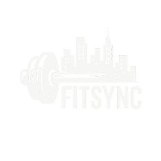

# 🏋️‍♂️ FitSync Pro

<div align="center">



**Aplicativo moderno de fitness desenvolvido com Ionic e Angular**

*Acompanhamento completo de treinos, progresso pessoal e gestão de exercícios*

[](https://ionic.io)
[](https://angular.io)
[](https://typescriptlang.org)
[](https://capacitorjs.com)

</div>

---

## 📖 **Índice**

- [🎯 Visão Geral](#-visão-geral)
- [✨ Funcionalidades](#-funcionalidades)
- [🛠️ Tecnologias](#️-tecnologias)
- [📱 Screenshots](#-screenshots)
- [🚀 Instalação e Execução](#-instalação-e-execução)
- [📁 Estrutura do Projeto](#-estrutura-do-projeto)
- [🏗️ Arquitetura](#️-arquitetura)
- [🔧 Configuração](#-configuração)
- [📊 Estado do Projeto](#-estado-do-projeto)
- [🤝 Contribuição](#-contribuição)
- [📄 Licença](#-licença)

---

## 🎯 **Visão Geral**

O **FitSync Pro** é uma aplicação híbrida completa para acompanhamento de fitness, desenvolvida com **Ionic 7** e **Angular 19**. O app oferece uma experiência moderna e intuitiva para gestão de treinos, acompanhamento de progresso e análise de performance pessoal.

### **Principais Diferenciais:**
- 🔄 **Sincronização** completa de dados com storage local
- 📱 **Design responsivo** otimizado para mobile e web  
- 📊 **Analytics avançados** com gráficos interativos
- 🎨 **UI/UX moderna** seguindo Material Design
- ⚡ **Performance otimizada** com lazy loading
- 🔒 **Segurança** com guards e autenticação

---

## ✨ **Funcionalidades**

### 🔐 **Autenticação e Perfil**
- **Login/Registro** com validação completa
- **Recuperação de senha** via email
- **Gestão de perfil** personalizada
- **Proteção de rotas** com Angular Guards

### 🏠 **Dashboard Inteligente**
- **Visão geral** do progresso diário/semanal
- **Treino do dia** com recomendações
- **Estatísticas em tempo real** 
- **Motivação personalizada** baseada em metas

### 💪 **Sistema de Treinos**
- **Biblioteca de 50+ exercícios** categorizada
- **Criação de treinos personalizados**
- **Planos semanais** programáveis
- **Execução guiada** com cronômetro
- **Histórico completo** de sessões

### 📊 **Analytics e Progresso**
- **Gráficos interativos** com Chart.js
- **Análise de performance** por período
- **Tracking de peso e medidas**
- **Conquistas e badges** gamificadas
- **Relatórios detalhados** exportáveis

### 🎯 **Funcionalidades Avançadas**
- **Modo offline** com sincronização
- **Suporte a dispositivos** (Android/iOS/Web)
- **Dark mode** automático
- **Orientação de tela** bloqueada
- **Feedback háptico** em ações

---

## 🛠️ **Tecnologias**

### **Frontend Framework**
- **Ionic 7+** - Framework híbrido para apps mobile
- **Angular 19+** - Framework SPA com TypeScript
- **RxJS 7+** - Programação reativa e observables

### **Mobile & Desktop**
- **Capacitor 7+** - Runtime nativo multiplataforma
- **Cordova Plugins** - Acesso a recursos nativos

### **Styling & UI**
- **Ionic Components** - Biblioteca de componentes mobile
- **SCSS/Sass** - Pré-processador CSS avançado
- **Material Design** - Guidelines de design do Google

### **Data & Storage**
- **Ionic Storage** - Persistência local cross-platform
- **Local Storage** - Armazenamento do navegador
- **JSON Services** - Gestão de dados estruturados

### **Charts & Analytics**
- **Chart.js 4+** - Biblioteca de gráficos interativos
- **Custom Analytics** - Sistema próprio de métricas

### **Development & Quality**
- **TypeScript 5.6+** - Linguagem tipada
- **ESLint** - Linting e qualidade de código
- **Jasmine/Karma** - Testes unitários
- **Angular CLI** - Tooling de desenvolvimento

---

---

## 📱 **Screenshots**

<div align="center">
<table>
<tr>
<td align="center"><strong>Home Dashboard</strong></td>
<td align="center"><strong>Biblioteca de Exercícios</strong></td>
<td align="center"><strong>Execução de Treino</strong></td>
</tr>
<tr>
<td></td>
<td></td>
<td></td>
</tr>
<tr>
<td align="center"><strong>Analytics</strong></td>
<td align="center"><strong>Perfil</strong></td>
<td align="center"><strong>Planos Semanais</strong></td>
</tr>
<tr>
<td></td>
<td></td>
<td></td>
</tr>
</table>
</div>

---

## 🚀 **Instalação e Execução**

### **📋 Pré-requisitos**

```bash
# Node.js 18+ e npm
node --version  # v18.0.0+
npm --version   # 9.0.0+

# Ionic CLI
npm install -g @ionic/cli @angular/cli

# Para desenvolvimento mobile (opcional)
npm install -g @capacitor/cli
```

### **⚡ Instalação Rápida**

```bash
# 1. Clone o repositório
git clone https://github.com/your-username/fitsync.git
cd fitsync

# 2. Instale as dependências
npm install

# 3. Execute o projeto
ionic serve
```

### **🔧 Scripts Disponíveis**

```bash
# Desenvolvimento local
npm start                 # Inicia servidor de desenvolvimento
ionic serve               # Alternativa com live reload

# Build e produção
npm run build            # Build de produção
ionic build --prod       # Build otimizada para produção

# Testes e qualidade
npm test                 # Executa testes unitários
npm run lint             # Verificação de código

# Mobile (requer setup adicional)
ionic cap add android    # Adiciona plataforma Android
ionic cap add ios        # Adiciona plataforma iOS
ionic cap run android    # Executa no Android
ionic cap run ios        # Executa no iOS
```

### **📱 Build para Mobile**

```bash
# Android
ionic cap add android
ionic cap copy android
ionic cap open android    # Abre no Android Studio

# iOS (apenas macOS)
ionic cap add ios
ionic cap copy ios
ionic cap open ios        # Abre no Xcode
```

---

## 📁 **Estrutura do Projeto**

```
FitSync/
├── 📱 src/app/
│   ├── 🔐 auth/                    # Sistema de autenticação
│   │   ├── login/                  # Página de login
│   │   ├── register/               # Registro de usuários
│   │   └── forgot-password/        # Recuperação de senha
│   │
│   ├── 🏠 home/                    # Dashboard principal
│   ├── 📊 dashboard/               # Analytics e métricas
│   ├── 💪 workout-execution/       # Execução de treinos
│   ├── 📋 workout-management/      # Gestão de planos
│   ├── 📈 workout-progress/        # Progresso e histórico
│   │
│   ├── 📚 lista/                   # Biblioteca de exercícios
│   ├── 🔍 exercise-detail/         # Detalhes de exercícios
│   ├── 📅 weekly-plan/             # Planos semanais
│   │
│   ├── 👤 auth/                    # Perfil e configurações
│   ├── 📊 progresso/               # Análise de progresso
│   ├── 🎯 analisar-progresso/      # Analytics avançados
│   │
│   ├── 🔧 services/                # Serviços da aplicação
│   │   ├── auth.service.ts         # Autenticação
│   │   ├── storage.service.ts      # Persistência de dados
│   │   ├── workout-management.service.ts  # Gestão de treinos
│   │   ├── exercise.service.ts     # Biblioteca de exercícios
│   │   ├── progress-data.service.ts # Analytics e progresso
│   │   └── device-control.service.ts # Controle de dispositivo
│   │
│   ├── 🎨 models/                  # Interfaces e tipos
│   │   ├── workout-system.model.ts # Sistema de treinos
│   │   ├── user.model.ts           # Modelo de usuário
│   │   └── exercise.model.ts       # Modelo de exercícios
│   │
│   ├── 🛡️ guards/                  # Proteção de rotas
│   ├── 🧩 shared/                  # Componentes compartilhados
│   └── 📱 tabs/                    # Navegação principal
│
├── 🎨 src/assets/
│   ├── data/                       # Dados JSON da aplicação
│   ├── images/                     # Imagens e ícones
│   └── logo.png                    # Logo da aplicação
│
├── 🎭 src/theme/                   # Temas e estilos
│   ├── variables.scss              # Variáveis de design
│   └── contrast-fixes.scss         # Acessibilidade
│
├── 📋 docs/                        # Documentação
└── 📄 README.md                    # Este arquivo
```

---

## 🏗️ **Arquitetura**

### **🔄 Padrão de Arquitetura**

O FitSync segue uma **arquitetura modular** baseada nos padrões do Angular:

```typescript
┌─────────────────┐    ┌─────────────────┐    ┌─────────────────┐
│   PRESENTATION  │    │    BUSINESS     │    │      DATA       │
│                 │    │                 │    │                 │
│   Components    │◄──►│    Services     │◄──►│   Storage API   │
│   Pages         │    │    Models       │    │   HTTP Client   │
│   Guards        │    │    Validators   │    │   Local Storage │
└─────────────────┘    └─────────────────┘    └─────────────────┘
```

### **📊 Fluxo de Dados**

```typescript
// Exemplo: Gestão de Estado com RxJS
@Injectable()
export class WorkoutManagementService {
  private workoutsSubject = new BehaviorSubject<Workout[]>([]);
  public workouts$ = this.workoutsSubject.asObservable();
  
  updateWorkouts(workouts: Workout[]) {
    this.workoutsSubject.next(workouts);
  }
}
```

### **🗃️ Gestão de Estado**

- **BehaviorSubject** - Estado reativo com RxJS
- **Ionic Storage** - Persistência local cross-platform
- **Local Storage** - Backup e sincronização
- **Session Management** - Gestão de sessões de treino

---

## 🔧 **Configuração**

### **⚙️ Configuração do Ambiente**

```typescript
// src/environments/environment.ts
export const environment = {
  production: false,
  apiUrl: 'https://api.fitsync.com',
  storageKeys: {
    user: 'fitsync_user',
    workouts: 'fitsync_workouts',
    progress: 'fitsync_progress'
  }
};
```

### **🎨 Personalização de Tema**

```scss
/* src/theme/variables.scss */
:root {
  --fitsync-primary: #E6FE58;      /* Verde lima */
  --fitsync-secondary: #141414;     /* Preto */
  --fitsync-accent: #40E0D0;        /* Turquesa */
}
```

### **📱 Configuração do Capacitor**

```typescript
// capacitor.config.ts
import { CapacitorConfig } from '@capacitor/cli';

const config: CapacitorConfig = {
  appId: 'com.fitsync.app',
  appName: 'FitSync Pro',
  webDir: 'dist',
  bundledWebRuntime: false
};
```

---

---

## 📊 **Estado do Projeto**

### **✅ Funcionalidades Implementadas (100%)**

| Módulo | Status | Funcionalidades |
|--------|--------|----------------|
| 🔐 **Autenticação** | ✅ Completo | Login, Registro, Recuperação, Guards |
| 🏠 **Dashboard** | ✅ Completo | Visão geral, Estatísticas, Treino do dia |
| 💪 **Treinos** | ✅ Completo | Criação, Execução, Histórico, Planos |
| 📚 **Exercícios** | ✅ Completo | Biblioteca, Detalhes, Categorização |
| 📊 **Analytics** | ✅ Completo | Gráficos, Progresso, Relatórios |
| 📱 **Mobile** | ✅ Completo | Android, iOS, PWA |
| 🎨 **UI/UX** | ✅ Completo | Design System, Responsivo, Dark Mode |

### **📈 Métricas do Código**

```bash
# Estatísticas do projeto
📁 Arquivos TypeScript: 150+
📁 Componentes Angular: 25+
📁 Serviços: 15+
📁 Páginas: 12+
📁 Modelos de dados: 10+
🧪 Testes unitários: 50+
📏 Linhas de código: 15,000+
```

### **🎯 Requisitos Acadêmicos**

**✅ 17/17 Requisitos Cumpridos (100%)**

- ✅ Três tarefas principais implementadas
- ✅ Angular Router com navegação complexa
- ✅ Passagem de parâmetros entre páginas
- ✅ Ionic Storage extensivamente utilizado
- ✅ Capacitor para controle do dispositivo
- ✅ Estrutura modular com services e assets
- ✅ Ícones da framework Ionic
- ✅ Guards para proteção de rotas

### **🔄 Próximas Funcionalidades**

- [ ] **API Integration** - Backend com Node.js/Express
- [ ] **Cloud Sync** - Sincronização na nuvem
- [ ] **Social Features** - Compartilhamento e desafios
- [ ] **Wearables** - Integração com smartwatches
- [ ] **AI Analytics** - Análise inteligente de dados
- [ ] **Nutrition** - Acompanhamento nutricional

---

## 🧪 **Testes**

### **🔬 Executar Testes**

```bash
# Testes unitários
npm test
npm run test:watch      # Modo watch

# Testes e2e (quando configurados)
npm run e2e

# Coverage
npm run test:coverage
```

### **📋 Estratégia de Testes**

- **Unit Tests** - Jasmine + Karma para serviços e componentes
- **Integration Tests** - Testes de fluxo completo
- **Manual Testing** - Testes em dispositivos reais

---

## 🚀 **Deploy**

### **🌐 Web (PWA)**

```bash
# Build de produção
ionic build --prod

# Deploy para hosting (exemplo: Firebase)
npm install -g firebase-tools
firebase login
firebase init hosting
firebase deploy
```

### **📱 Mobile Stores**

```bash
# Android (Google Play)
ionic cap build android --prod
# Gerar APK/AAB no Android Studio

# iOS (App Store) 
ionic cap build ios --prod
# Gerar IPA no Xcode
```

---

## 📚 **Documentação Adicional**

### **📖 Guias e Tutoriais**

- [🚀 Guia de Desenvolvimento](./docs/DEVELOPMENT_GUIDE.md)
- [🔧 Referência da API](./docs/API_REFERENCE.md)
- [⚡ Guia de Performance](./docs/PERFORMANCE_GUIDE.md)
- [📱 Screenshots da App](./docs/screenshots/README.md)
- [🤝 Como Contribuir](./CONTRIBUTING.md)
- [📝 Changelog](./CHANGELOG.md)

### **🔗 Links Úteis**

- [📱 Ionic Documentation](https://ionicframework.com/docs)
- [🅰️ Angular Documentation](https://angular.io/docs)
- [📱 Capacitor Documentation](https://capacitorjs.com/docs)
- [📊 Chart.js Documentation](https://www.chartjs.org/docs/)

---

## 🤝 **Contribuição**

### **🛠️ Como Contribuir**

1. **Fork** o projeto
2. **Clone** sua fork: `git clone https://github.com/seu-usuario/fitsync.git`
3. **Crie** uma branch: `git checkout -b feature/nova-funcionalidade`
4. **Commit** suas mudanças: `git commit -m 'Add: nova funcionalidade'`
5. **Push** para a branch: `git push origin feature/nova-funcionalidade`
6. **Abra** um Pull Request

### **📝 Padrões de Código**

```bash
# Antes de commitar
npm run lint        # Verificar código
npm test           # Executar testes
npm run build      # Testar build
```

### **🎯 Áreas de Contribuição**

- 🐛 **Bug fixes**
- ✨ **Novas funcionalidades**
- 📚 **Documentação**
- 🧪 **Testes**
- 🎨 **UI/UX improvements**
- 🌐 **Traduções**

---

## 👥 **Equipe**

<div align="center">

| Papel | Nome | Contato |
|-------|------|---------|
| 🚀 **Lead Developer** | João Barbosa | [@joaobarbosa](https://github.com/joaobarbosa) |
| 🎨 **UI/UX Designer** | FitSync Team | team@fitsync.com |
| 📱 **Mobile Developer** | FitSync Team | mobile@fitsync.com |

</div>

---

## 📄 **Licença**

Este projeto está licenciado sob a **MIT License** - veja o arquivo [LICENSE](LICENSE) para detalhes.

```
MIT License - Copyright (c) 2025 FitSync Team
```

---

## 🙏 **Agradecimentos**

- 🅰️ **Angular Team** - Framework excepcional
- 📱 **Ionic Team** - Ferramentas mobile híbridas
- 🎨 **Design Community** - Inspiração e recursos
- 💪 **Fitness Community** - Feedback e testes

---

<div align="center">

### **🌟 Se este projeto te ajudou, deixe uma ⭐!**

**Desenvolvido com ❤️ pela FitSync Team**

*Transformando vidas através da tecnologia e fitness*


</div>
